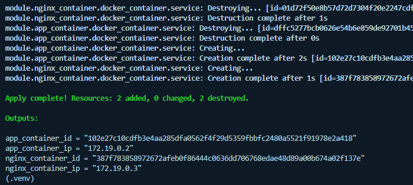

# Multi-Container Webanwendung mit Docker und Terraform

## 1. **Problemstellung**

Für die lokale Entwicklung oder das Testen von Anwendungen ist es üblich, mehrere Container mit eigenen Netzwerken und ggf. Volumes aufzusetzen (z.B. Webserver + App-Container). Manuelles Erstellen, Verbinden und Löschen dieser Ressourcen ist fehleranfällig und nicht wiederholbar.
**Infrastructure as Code (IaC)** mit Terraform löst dieses Problem: Die Infrastruktur ist versionierbar, nachvollziehbar und mit wenigen Befehlen automatisiert auf- und abbaubar.

---

## 2. **Warum Terraform für dieses Szenario?**

* **Wiederholbarkeit:** Infrastruktur kann identisch immer wieder bereitgestellt werden.
* **Versionierbarkeit:** Änderungen an der Infrastruktur sind nachvollziehbar (Git).
* **Automatisierbarkeit:** Einfache Anpassung und schnelles Rollback möglich.
* **Modularisierung:** Bausteine wie Container-Definitionen sind wiederverwendbar.
* **Kollaboration:** Teams können gemeinsam an der Infrastruktur arbeiten.

---

## 3. **Architekturübersicht**

* **Provider:** Docker Provider (`kreuzwerker/docker`)
* **Ressourcen:**

  * Docker-Netzwerk
  * Optionales Volume für die App
  * Zwei Container (Nginx als Reverse Proxy, App-Container z.B. httpbin)
  * Beide Container im gleichen Docker-Netzwerk
* **Module:**

  * Wiederverwendbares Modul für „containerized\_service“ (Container mit Netzwerk + optional Volume)

**Architekturdiagramm:**

```
[Client] → [nginx:8080] → [Docker Network: appnet] → [httpbin:80 + Volume]
```

---

## 4. **Anwendung der Terraform-Bausteine**

### **Variablen**

* `network_name` (string): Name des Docker-Netzwerks
* `nginx_image`, `app_image` (string): Images für die Container
* `expose_ports` (list(number)): Extern exponierte Ports
* `enable_volume` (bool): Ob das App-Volume genutzt werden soll

### **Locals**

* Automatisch zusammengesetzte Namen für Container und Volume auf Basis der Variablen

### **Module**

* Das Modul `containerized_service` wird mit unterschiedlichen Parametern für App und Nginx verwendet und kapselt die Container-Logik (Image, Ports, Netzwerk, Volume).

### **Outputs**

* IDs und IPs der beiden Container zur Überprüfung (z.B. für `docker ps` oder Weiterverwendung)

---

## 5. **Vergleich zu anderen Methoden**

**Manuell:**
Viele Einzelschritte mit Docker CLI, fehleranfällig, schwer nachvollziehbar.

**Terraform:**

* Deklarativer Ansatz, Änderungen werden sauber nachgezogen.
* Übersichtliche, versionierte Konfiguration.
* Guter Überblick über den aktuellen Zustand.

**Im Vergleich zu CloudFormation oder ARM:**

* Weniger cloud-spezifisch, einfacheres, lesbares HCL.
* Ideal für lokale Infrastruktur und Container-Workflows.

---

## 6. **Herausforderungen**

* Die genaue Übergabe des Docker-Providers ins Modul war notwendig, da der Standard-Provider-Namespace `hashicorp/docker` veraltet ist und jetzt `kreuzwerker/docker` verwendet wird.
* Die dynamische Einbindung von Volumes im Modul erforderte einen `dynamic`-Block und einen leeren String als „Dummy“-Parameter, wenn kein Volume genutzt wird.
* Typische Fehlerquellen: Falsche Provider-Namespaces, fehlende oder falsch benannte lokale Variablen, Unterschiede zwischen `network_id` und `network_name`.

---

## 7. **Warum ist das Projekt nicht trivial?**

* Nutzung von Modulen (Kapselung, Wiederverwendbarkeit)
* Parametrisierung über mehrere Variablen-Typen (string, list, bool)
* Kombination mehrerer Ressourcen (Netzwerk, Volumes, Container)
* Zusammenspiel von Locals, Outputs und Modulparametern
* Änderung und Löschung werden sauber über den Terraform-Workflow abgebildet

---

## 8. **Best Practices (Git & Sicherheit)**

* `.terraform/` und `terraform.tfstate*` sind in `.gitignore`
* Regelmäßig aussagekräftige Commits im Git-Repo (siehe Screenshot)
* Keine Klartext-Secrets in .tf-Dateien!

---

## 9. **Screenshots**

* **terraform init:**
  
* **terraform plan (erster Durchlauf):**
  
* **terraform apply:**
  
* **docker ps (nach apply):**
  
* **terraform plan (nach Änderung, zeigt \~):**
  
* **terraform apply (nach Update):**
  
* **terraform destroy:**
  

---

## 10. **Beispiel: Wie habe ich das Update gemacht?**

> Ich habe in der Datei `variables.tf` den Wert für `expose_ports` von `8080` auf `8082` geändert und gespeichert.
> Danach habe ich `terraform plan` ausgeführt und im Output die Tilde (`~`) für die geänderte Ressource gesehen (Portmapping des Nginx-Containers).
> Nach erfolgreichem `terraform apply` war der Port in `docker ps` ebenfalls aktualisiert.

---

## 11. **Fazit**

Mit Terraform lassen sich auch lokale, mehrschichtige Container-Stacks effizient, wiederholbar und nachvollziehbar bereitstellen. Durch Nutzung von Modulen, Variablen, Locals und Outputs konnte ich die wichtigsten IaC-Konzepte aus dem Kurs erfolgreich anwenden und typische Fehler beheben.

---